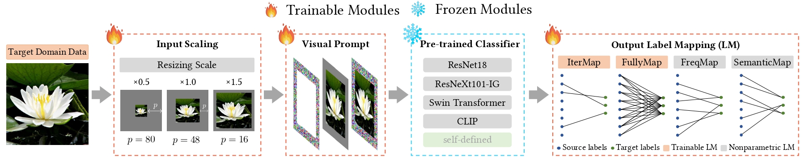
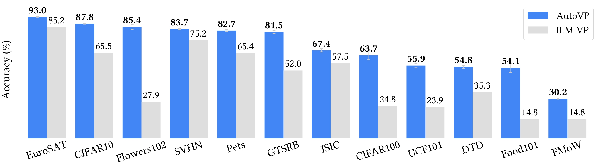

# AutoVP: An Automated Visual Prompting Framework and Benchmark
## Overview
This repository contains code for the ICLR 2024 Paper "[AutoVP: An Automated Visual Prompting Framework and Benchmark](https://arxiv.org/abs/2310.08381)" by Hsi-Ai Tsao*, [Lei Hsiung](https://hsiung.cc/)*, [Pin-Yu Chen](http://pinyuchen.com/), [Sijia Liu](https://lsjxjtu.github.io/), and [Tsung-Yi Ho](https://tsungyiho.github.io/).

Visual prompting (VP) is an emerging parameter-efficient fine-tuning approach to adapting pre-trained vision models to solve various downstream image-classification tasks. However, there has hitherto been little systematic study of the design space of VP and no clear benchmark for evaluating its performance. To bridge this gap, we propose AutoVP, an end-to-end expandable framework for automating VP design choices, along with 12 downstream image-classification tasks that can serve as a holistic VP-performance benchmark. Our design space covers 1) the joint optimization of the prompts; 2) the selection of pre-trained models, including image classifiers and text-image encoders; and 3) model output mapping strategies, including nonparametric and trainable label mapping. Our extensive experimental results show that AutoVP outperforms the best-known current VP methods by a substantial margin, having up to 6.7% improvement in accuracy; and attains a maximum performance increase of 27.5% compared to linear-probing (LP) baseline. AutoVP thus makes a two-fold contribution: serving both as an efficient tool for hyperparameter tuning on VP design choices, and as a comprehensive benchmark that can reasonably be expected to accelerate VP's development.

## Dependencies

Run `pip3 install -r requirements.txt`.

## Datasets
Flowers102, DTD, EuroSAT, UCF101, and ILM_Dataloader.py are from [ILM-VP](https://github.com/OPTML-Group/ILM-VP).

ISIC (Melanoma) Dataset is from [ISIC](https://dataverse.harvard.edu/dataset.xhtml?persistentId=doi%3A10.7910%2FDVN%2FDBW86T).

## Experiments

**VP Training with Specified Setting:**

`python3 demo.py --dataset "OxfordIIITPet" --datapath "./OxfordIIITPet" --download 1 --pretrained "clip" --mapping_method "frequency_based_mapping" --out_map_num 10 --img_scale 1.5 --lr 40 --epoch 100`

* Parameters in `demo.py`:
    * `dataset` and `datapath`: Name of the dataset and directory path.

    * `download`: Download the dataset or not.

    * `param_tune`: Perform hyperparameter tuning and train the model using the best configuration selected during tuning. 

    * `LR_WD_tune`: Perform additional hyperparameter tuning on learning rate (LR) and weight decay (WD) and train on the best configuration. 

    * `pretrained`: The pre-trained source model.

    * `mapping_method`: The output mapping method.

    * `img_scale`: The initial image scale.

    * `out_map_num`: The number of source labels mappd to each target label.

    * `train_resize`: Turn on the trainable image resize module or not.

    * `freqmap_interval`: Frequency mapping interval (-1 for FreqMap, >1 for IterMap).

    * `weightinit`: When using CLIP as the pre-trained model and FullyMap as the output mapping, it is recommended to turn on weight initialization.

    * `epoch`, `lr`, `seed`: The training epoch, learning rate (recommended: lr=40 for CLIP, otherwise set to 0.001), and random seed.

    * `scalibility_rio`: The data usage proportion (1/scalibility_rio). 

    * `scalibility_mode`: The data splitting strategy.

**Hyper-Parameter Tuning and VP Training:** 

* Tunable VP configurations: `pretrained`, `mapping_method`, `img_scale`, `out_map_num`, `train_resize`, and `freqmap_interval`

    * `python3 demo.py --dataset "OxfordIIITPet" --datapath "./OxfordIIITPet" --download 1 --param_tune 1`

* Additional tunable parameters: `lr` and `weight_decay`
    * Perform tuning on both VP configurations and additional parameters: 

    `python3 demo.py --dataset "OxfordIIITPet" --datapath "./OxfordIIITPet" --download 1 --param_tune 1 --LR_WD_tune 1`
    
    * Perform tuning on additional parameters with specified settings: 

    `python3 demo.py --dataset "OxfordIIITPet" --datapath "./OxfordIIITPet" --download 1 --pretrained "clip" --mapping_method "frequency_based_mapping" --out_map_num 10 --img_scale 1.5 --LR_WD_tune 1`

**Baseline Evaluation:** 

`python3 Baseline.py --dataset "OxfordIIITPet" --datapath "./OxfordIIITPet" --download 1 --pretrained "clip" --baseline "CLIP_LP" --lr 40 --epoch 100`

* Parameters in `Baseline.py`
    * `dataset` and `datapath`: Name of the dataset and directory path.

    * `download`: Download the dataset or not.

    * `pretrained`: The pre-trained source model.

    * `epoch`, `lr`, `seed`: The training epoch, learning rate (recommended: lr=40 for CLIP, otherwise set to 0.001), and random seed.

    * `scalibility_rio`: The data usage proportion (1/scalibility_rio). 

    * `scalibility_mode`: The data splitting strategy.

    * `baseline`: The baseline mode. When using CLIP a pre-trained model, please choose `CLIP_LP` for linear probing training. 

**Evaluate on the Previous Checkpoint:**

`python3 Evaluation.py --dataset "OxfordIIITPet" --datapath "./OxfordIIITPet" --download 1`

* Parameters in `Evaluation.py`
    * `dataset` and `datapath`: Name of the dataset and directory path. It will evaluate on the checkpoint file `{dataset}_last.pth`

    * `download`: Download the dataset or not.

    * `epoch`, `lr`, `seed`: The training epoch, learning rate (recommended: lr=40 for CLIP, otherwise set to 0.001), and random seed.

    * `scalibility_rio`: The data usage proportion (1/scalibility_rio). 

    * `scalibility_mode`: The data splitting strategy.

**Plot the Learned Prompts in Frequency Domain**

`python3 frequency_analysis.py --dataset "OxfordIIITPet"`

* Parameters in `frequency_analysis.py`
    * `dataset`: Name of the dataset. It will evaluate on the checkpoint file `{dataset}_last.pth`

## Citations
If you find this helpful for your research, please cite our papers as follows:

    @inproceedings{tsao2024autovp,
      title={{AutoVP: An Automated Visual Prompting Framework and Benchmark}}, 
      author = {Hsi-Ai Tsao and Lei Hsiung and Pin-Yu Chen and Sijia Liu and Tsung-Yi Ho},
      booktitle={The Twelfth International Conference on Learning Representations},
      year = {2024}
    }
